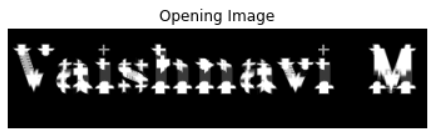

# Opening-and-Closing

## Aim
To implement Opening and Closing using Python and OpenCV.

## Software Required
1. Anaconda - Python 3.7
2. OpenCV
## Algorithm:
### Step1:
Import the necessary packages from the libraries
### Step2:
Create the Text using cv2.putText
### Step3:
Create the structuring element
### Step4:
Use Opening operation create the image
### Step5:
Use Closing Operation create the image
### Step 6:
End the program.

## Program:

``` Python
# Import the necessary packages
import numpy as np
import matplotlib.pyplot as plt
import cv2
# Create the Text using cv2.putText
image = np.zeros((100,420),dtype='uint8')
font=cv2.FONT_HERSHEY_SIMPLEX = 3
cv2.putText(image,"Vaishnavi M",(5,60),font,2,(255),5,cv2.LINE_AA)
plt.title("Original Image")
plt.imshow(image,'gray')
plt.axis('off')
# Create the structuring element
kernel=cv2.getStructuringElement(cv2.MORPH_CROSS,(10,10))
# Use Opening operation
open_image=cv2.morphologyEx(image,cv2.MORPH_OPEN,kernel)
plt.title("Opening Image")
plt.imshow(open_image,'gray')
plt.axis('off')
# Use Closing Operation
close_image=cv2.morphologyEx(image,cv2.MORPH_CLOSE,kernel)
plt.title("Closing image")
plt.imshow(close_image,'gray')
plt.axis('off')

```
## Output:

### Display the input Image

<br>

### Display the result of Opening

<br>

### Display the result of Closing

<br>

## Result
Thus the Opening and Closing operation is used in the image using python and OpenCV.